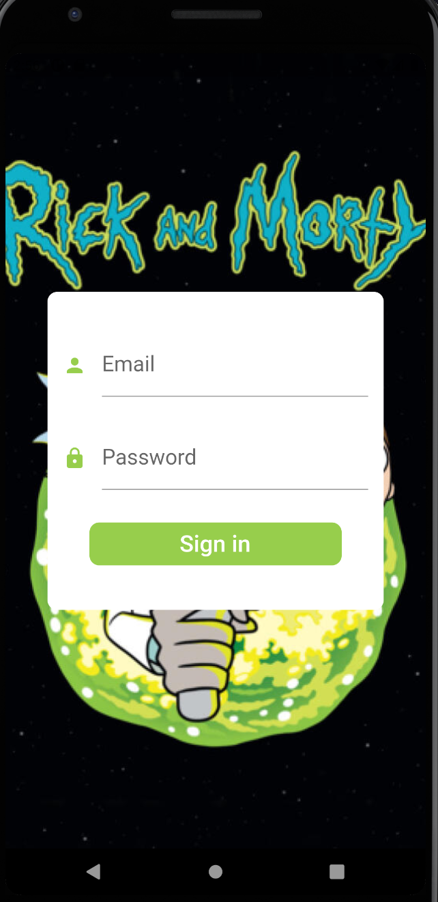
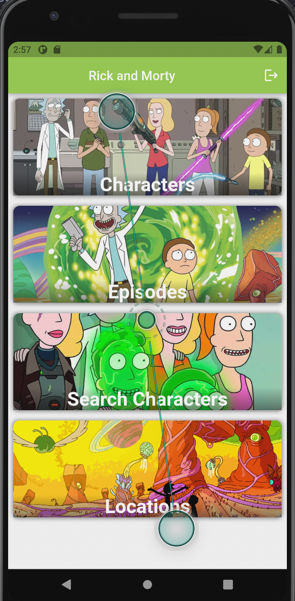
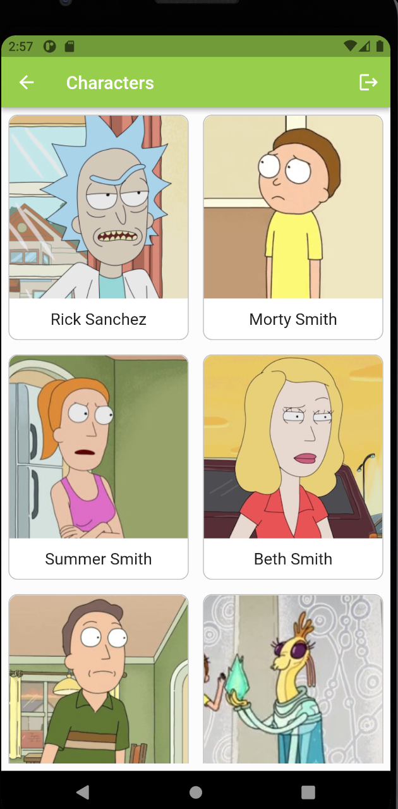
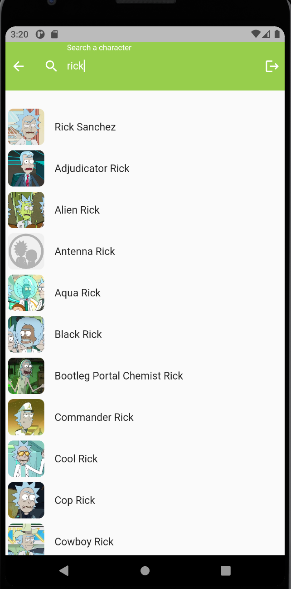
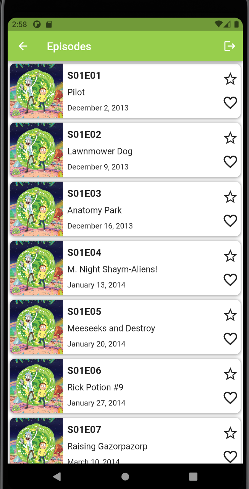
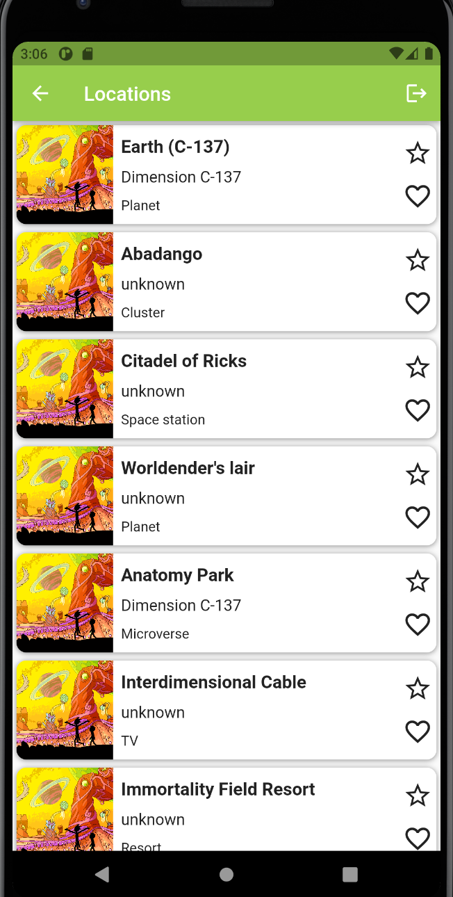

# Rick and Morty Challenge

## Descripción
Este proyecto es una aplicación móvil que muestra información acerca de la serie animada Rick y Morty. La app se centra en mostrar a los **Personajes**, los **Episodios** y las **Locaciones**.

La app cuenta con:
- Autenticación
- Lista de Personajes
- Lista de Episodios
- Lista de Locaciones
- Buscador de Personajes
<div>
    
    
    
</div>
<div>
    
    
    
</div>

## Instalación
1. Clonar el repositorio
   ```sh
   git clone https://github.com/alexdl97/rick_and_morty_challenge.git
   ```
2. Instalar los paquetes
   ```sh
   flutter pub rick_and_morty_challenge
   ```
